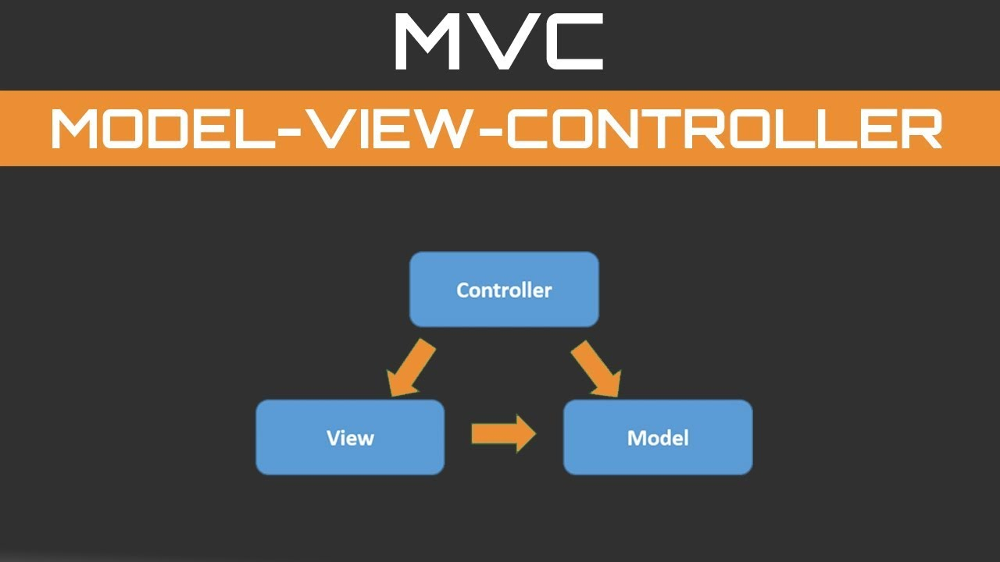

# Gfinp (incompleto)

1- [O que é o Gfinp](#o-que-é-gfinp)

2- [Arquitetura do Gfinp (MVC)](#arquitetura-do-gfinp)

3- [Como rodar o Gfinp](#como-rodar-o-gfinp)

* 3.1 - [Instale o docker](https://docs.docker.com/engine/install/ubuntu/)

* 3.2 - [Instale o docker-compose](https://docs.docker.com/compose/install/)

* 3.3 - [Instale o node.js](https://tecadmin.net/install-latest-nodejs-npm-on-ubuntu/)

3- [Acessando o sistema web](#acessando-o-sistema-web)

# O que é Gfinp?
## Gfinp 
É uma plataforma web responsavel por organizar e gerir sua área financeira. O nome é uma sigla para Gestão Finaceira Perssoal.
## Tecnologias Utilizadas
Atenção: Lembrando q todos esses comandos são baseados em cima no sistema operacional linux-ubuntu

* node.js e mondodb   (back-end/banco de dados)
* react.js   (front-end)
* docker e docker-compose (devops)

# Arquitetura do Gfinp (MVC)

MVC é um padrão de arquitetura de software, separando sua aplicação em 3 camadas. A camada de interação do usuário (view), a camada de manipulação dos dados (model) e a camada de controle (controller)

* obsevação: Sendo que o model e controller são em realizados atraves do node.js e view sendo realizado pelo react.js

# Como Rodar o Gfinp
## Subindo o Gfinp
Atenção: Verifique que você tenha o docker e o docker compose intalado na sua maquina para rodar o conteiner do back-end, e você deve abrir 2 terminais um para o font e outro pro back

    docker -v && docker-compose -v

### Back-End (Primeiro Terminal)
Construir a imagem

    docker-compose build  

Subir a imagem

    docker-compose up

### Fron-End (Segundo Terminal)
Atenção: Verifique que você esteja dentro da pasta raiz do front-end

    npm install && npm run start

## Acessando o sistema web
O sistema estará no seguinte [link](http://localhost:3000/)

    http://localhost:3000

